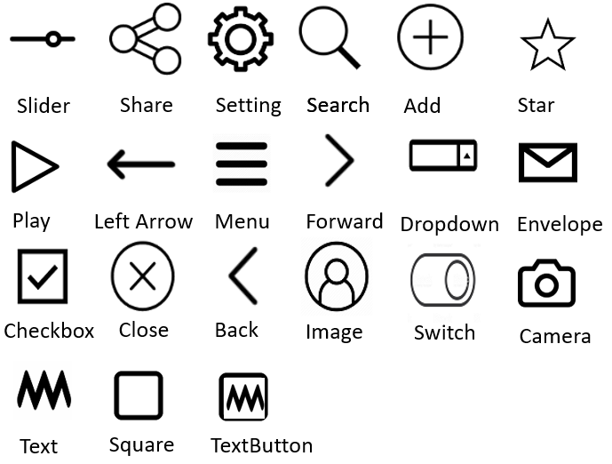

# Doodle2App
Doodle2App offers a substitute for paper, i.e., a drawing interface and an interactive UI preview and can convert sketches to a compilable Android application. 

# Doodle to app recognizes following categories

## Dependencies-
1. Tensorflow - '1.9.0'
2. Flask

